# Plano de Reorganização de Aula: Bootstrap e Testes A/B
**Disciplina:** Ciência de Dados / Estatística Computacional
**Carga Horária:** 2 horas (120 minutos)

Este documento apresenta a proposta de reorganização da **Aula 10 (Bootstrap e Testes A/B)** da UFMG para uma estrutura altamente didática, focada em Ciência de Dados aplicada. A nova estrutura equilibra fundamentação conceitual, métodos matemáticos tradicionais, o poder da computação (reamostragem) e aplicações reais em negócios e saúde.

---

## 🎯 Objetivos de Aprendizagem

Ao final desta aula, os alunos serão capazes de:
1. **Diferenciar** inferência clássica (TCL) de inferência baseada em simulação computacional (Bootstrap).
2. **Explicar** intuitivamente o funcionamento do método Bootstrap para estimativa de parâmetros populacionais.
3. **Implementar** o algoritmo Bootstrap em Python para obter distribuições de reamostragem e Intervalos de Confiança (IC).
4. **Executar** testes A/B estruturados para comparar as médias de dois grupos distintos (Tratamento vs. Controle).
5. **Avaliar** a significância estatística de um teste A/B por meio da análise do IC da diferença entre médias e visualizações como a Função de Distribuição Acumulada Empírica (ECDF).
6. **Tomar Decisões** fundamentadas em dados reais de negócios (UX/conversão) e de saúde pública.

---

## 📚 Conteúdos Abordados

1. **Amostragem e População:** O problema fundamental da inferência estatística.
2. **Testes A/B em Engenharia de Software e Negócios:** Definição, aplicações e métricas de sucesso.
3. **Revisão de TCL e IC Clássico:** Teorema Central do Limite e premissas.
4. **O Princípio do Bootstrap (Reamostragem):** Mecanismo de reamostragem com reposição.
5. **Intervalos de Confiança via Bootstrap:** O método de percentis.
6. **Comparação de Dois Grupos (Testes A/B Computacionais):**
   * Distribuição das médias individuais dos grupos.
   * Diferença de médias via reamostragem conjunta.
   * Papel do valor zero na determinação do efeito.
7. **Visualização Avançada para Tomada de Decisão:** Boxplots de médias, Histogramas da diferença e ECDF.

---

## ⏱️ Cronograma Sugerido

```mermaid
gantt
    title Cronograma de Aula (120 min)
    dateFormat  X
    axisFormat %H:%M
    section Teoria & Contexto
    Introdução aos Testes A/B e Negócios : active, 0, 15
    O TCL e Limitações Clássicas : 15, 30
    section Bootstrap
    O Princípio do Bootstrap (Teoria) : 30, 50
    Exemplo Sintético e Convergência (Prática) : 50, 65
    section Testes A/B
    Caso Prático 1: Tabagismo e Peso do Bebê : 65, 90
    Caso Prático 2: Layout de E-commerce : 90, 110
    Encerramento, Dúvidas e Exercícios : 110, 120
```



*   **00-15 min | Introdução e Motivação:** Aplicação prática dos Testes A/B no mercado de tecnologia (Netflix, Booking, Amazon) e na ciência.
*   **15-30 min | Inferência Clássica vs. Computacional:** Apresentação rápida do TCL e discussão de suas limitações na vida real (pequenas amostras, distribuições não normais, dependência analítica).
*   **30-50 min | O Princípio do Bootstrap:** O concept de reamostrar com reposição como aproximação da população. Algoritmo passo a passo.
*   **50-65 min | Demonstração Sintética:** Comparação de convergência entre o IC Clássico e o IC Bootstrap variando o tamanho da amostra.
*   **65-90 min | Caso de Uso de Saúde (Peso de Bebês):** Aplicação prática no dataset clássico `baby.csv` para estimar o impacto de fumar na gravidez.
*   **90-110 min | Caso de Uso de Negócios (Ticket Médio):** Aprofundamento com teste A/B prático de layouts de e-commerce e uso da ECDF para suporte à decisão.
*   **110-120 min | Fechamento e Próximos Passos:** Conexão com os conceitos de testes de permutação (aula seguinte) e resumo dos aprendizados.

---

## 📑 Proposta de Estrutura de Slides (Reorganizada)

Aqui está o roteiro sugerido de slides, contendo os tópicos, o layout visual proposto e notas explicativas para o professor.

### Módulo 1: Introdução ao Problema da Comparação

#### Slide 1: Título e Apresentação
*   **Título:** Bootstrap e Testes A/B: Uma Abordagem Prática e Computacional
*   **Subtítulo:** Estatística inferencial intuitiva e moderna para tomada de decisão em Ciência de Dados
*   **Elementos Visuais:** Ícones ou imagens que remetam a amostragem, gráficos de distribuição e o logotipo da universidade/curso.
*   **Nota do Professor:** Iniciar com um exemplo cativante de mercado (ex: a Netflix testando se a imagem da capa de uma série altera a taxa de cliques).

#### Slide 2: O Problema da Inferência
*   **Título:** Como Conhecer a População Tendo Apenas uma Amostra?
*   **Pontos-chave:**
    *   Temos uma amostra de tamanho $N$.
    *   Queremos estimar a média da população real ($\mu$).
    *   Não temos orçamento ou acesso à população completa.
    *   **Solução Tradicional:** Fórmulas matemáticas que exigem muitas premissas (ex: Normalidade).
    *   **Solução Computacional:** Reamostragem.
*   **Elementos Visuais:** Diagrama de fluxo mostrando População $\rightarrow$ Amostra $\rightarrow$ Estatística.

#### Slide 3: O que é um Teste A/B?
*   **Título:** O Padrão Ouro para Testar Hipóteses
*   **Pontos-chave:**
    *   **Grupo A (Controle):** Experiência atual, layout clássico, medicamento placebo.
    *   **Grupo B (Tratamento):** Nova funcionalidade, checkout expresso, novo princípio ativo.
    *   **Objetivo:** Medir se a diferença de performance ($\text{Média}_B - \text{Média}_A$) é estatisticamente significativa ou mero fruto do acaso.
*   **Elementos Visuais:** Esquema ilustrativo de divisão de tráfego de usuários (50% Layout Antigo, 50% Layout Novo).

#### Slide 3b: Exemplo Matemático: Estimativa de Parâmetros
*   **Título:** Estimando o Tempo de Carregamento de Página
*   **Pontos-chave:**
    *   Medimos o tempo de carregamento de uma página em 5 visitas (em segundos):
        $$X = \{1.5, 2.3, 1.8, 3.0, 2.4\}$$
    *   A estimativa pontual da média populacional $\mu$ é a média amostral $\bar{X}$:
        $$\bar{X} = \frac{1.5 + 2.3 + 1.8 + 3.0 + 2.4}{5} = \frac{11.0}{5} = 2.2\text{ s}$$
    *   **Problema:** Se coletarmos outra amostra de 5 visitas, a média será exatamente $2.2\text{ s}$? Provavelmente não. A média amostral é uma variável aleatória.
*   **Elementos Visuais:** Lista com os valores e cálculo passo a passo.

#### Slide 3c: Demonstração em Python: Média Amostral e Variabilidade
*   **Título:** Calculando e Simulando Variabilidade de Ponto
*   **Código Exemplo:**
    ```python
    import numpy as np
    
    # Amostra de tempos de carregamento (em segundos)
    X = np.array([1.5, 2.3, 1.8, 3.0, 2.4])
    
    # Estimativa pontual da media
    media_amostral = np.mean(X)
    print(f"Media amostral: {media_amostral:.2f} s")
    
    # Simulando a variabilidade amostral (se a populacao fosse conhecida)
    np.random.seed(42)
    populacao = np.random.normal(loc=2.2, scale=0.5, size=10000)
    novas_medias = [np.random.choice(populacao, size=5).mean() for _ in range(1000)]
    print(f"Desvio padrao das medias (erro padrao): {np.std(novas_medias):.3f}")
    ```

---

### Módulo 2: O Método Clássico e o Teorema Central do Limite (TCL)

#### Slide 4: O Método Clássico (TCL)
*   **Título:** O Teorema Central do Limite
*   **Pontos-chave:**
    *   A distribuição das médias amostrais aproxima-se de uma normal à medida que o tamanho da amostra cresce.
    *   Fórmula do Intervalo de Confiança Clássico:
        $$IC = \bar{X} \pm Z \times \frac{s}{\sqrt{n}}$$
    *   Fácil de computar, mas possui premissas estritas.
*   **Elementos Visuais:** Gráfico de uma curva normal destacando os limites dos percentis de 2.5% e 97.5% (Z = 1.96).

#### Slide 5: Limitações do Método Clássico
*   **Título:** Por que precisamos de algo mais?
*   **Pontos-chave:**
    *   E se os dados forem extremamente assimétricos e a amostra for pequena?
    *   E se a estatística que queremos avaliar não for a média (ex: mediana, percentis, variância)? A derivação matemática clássica torna-se impraticável.
    *   **O Bootstrap resolve isso** sem exigir fórmulas matemáticas complexas para cada estatística diferente.
*   **Elementos Visuais:** Histograma com alta assimetria e presença de outliers extremos.

#### Slide 5b: Exemplo Matemático: IC via TCL
*   **Título:** Tempo de Atendimento ao Cliente
*   **Pontos-chave:**
    *   Medimos o tempo médio de atendimento de $N=36$ clientes:
        *   Média amostral ($\bar{X}$): $100$ segundos.
        *   Desvio padrão amostral ($s$): $15$ segundos.
    *   Erro padrão da média ($SE$):
        $$SE = \frac{s}{\sqrt{N}} = \frac{15}{\sqrt{36}} = 2.5\text{ s}$$
    *   Para 95% de confiança ($Z = 1.96$):
        $$IC = 100 \pm 1.96 \times 2.5 = [95.1\text{ s}, 104.9\text{ s}]$$
*   **Elementos Visuais:** Gráfico exibindo a estimativa pontual centralizada com barras de erro de $\pm 4.9\text{ s}$.

#### Slide 5c: Demonstração em Python: IC Clássico
*   **Título:** Computando o IC Clássico
*   **Código Exemplo:**
    ```python
    import numpy as np
    import scipy.stats as ss
    
    # Dados amostrais simulados (N=36, media=100, std=15)
    np.random.seed(42)
    dados = np.random.normal(loc=100, scale=15, size=36)
    
    # Calculos intermediarios
    n = len(dados)
    media = np.mean(dados)
    desvio = np.std(dados, ddof=1) # Desvio padrao amostral
    erro_padrao = desvio / np.sqrt(n)
    
    # Encontrando o z critico para 95%
    z_critico = ss.norm.ppf(0.975)
    
    # Limites do intervalo
    lim_inf = media - z_critico * erro_padrao
    lim_sup = media + z_critico * erro_padrao
    print(f"IC Classico: [{lim_inf:.2f}, {lim_sup:.2f}]")
    ```

---

### Módulo 3: O Método Bootstrap (Reamostragem)

#### Slide 6: O Princípio do Bootstrap
*   **Título:** Puxar-se pelas Próprias Botas (*Bootstrap*)
*   **Pontos-chave:**
    *   Termo originado da expressão inglesa *"to pull oneself up by one's bootstraps"* (fazer o impossível com os recursos atuais).
    *   **A premissa:** A amostra original é a melhor aproximação disponível da população real.
    *   Podemos simular a extração de novas amostras da população fazendo **reamostragem com reposição** da nossa própria amostra original.
*   **Elementos Visuais:** Ilustração lúdica de uma pessoa puxando as próprias botas e um fluxograma da amostragem com reposição.

#### Slide 7: O Algoritmo Bootstrap (Passo a Passo)
*   **Título:** Como Funciona o Algoritmo na Prática?
*   **Pontos-chave:**
    1. Dada uma amostra original de tamanho $N$.
    2. Sorteie $N$ elementos dessa amostra **com reposição** (alguns elementos se repetirão, outros ficarão de fora).
    3. Calcule a estatística de interesse (ex: média) para essa nova amostra.
    4. Repita os passos 2 e 3 um grande número de vezes $M$ (ex: $M = 5000$).
    5. A distribuição dessas $M$ médias calculadas é a nossa distribuição bootstrap.
*   **Elementos Visuais:** Tabela com exemplo numérico de sorteio simples.

#### Slide 7b: Exemplo Matemático: Bootstrap Manual
*   **Título:** Reamostragem Passo a Passo
*   **Pontos-chave:**
    *   Amostra original $S = \{2, 4, 9\}$ com $N=3$. Média observada: $\bar{X} = 5.0$.
    *   Vamos gerar 4 reamostras bootstrap tiradas com reposição:
        *   **Reamostra 1:** $\{2, 2, 9\} \rightarrow \bar{X}^*_1 = 4.33$
        *   **Reamostra 2:** $\{4, 9, 9\} \rightarrow \bar{X}^*_2 = 7.33$
        *   **Reamostra 3:** $\{2, 4, 4\} \rightarrow \bar{X}^*_3 = 3.33$
        *   **Reamostra 4:** $\{9, 2, 9\} \rightarrow \bar{X}^*_4 = 6.67$
    *   Médias bootstrap ordenadas: $\{3.33, 4.33, 6.67, 7.33\}$.
*   **Elementos Visuais:** Esquema conectando a amostra original com as reamostras correspondentes e as médias de cada uma.

#### Slide 7c: Demonstração em Python: Bootstrap Manual
*   **Título:** Simulação Prática do Bootstrap
*   **Código Exemplo:**
    ```python
    import numpy as np
    
    # Amostra original
    S = np.array([2, 4, 9])
    n = len(S)
    
    # Gerando reamostras com reposicao
    np.random.seed(42)
    m = 4 # Apenas 4 reamostras para ilustrar
    medias_bs = []
    
    for i in range(m):
        reamostra = np.random.choice(S, size=n, replace=True)
        media_tmp = reamostra.mean()
        medias_bs.append(media_tmp)
        print(f"Reamostra {i+1}: {reamostra} -> Media: {media_tmp:.2f}")
    
    # Calculo de percentil com 10000 simulacoes para IC de 95%
    todas_medias = [np.random.choice(S, size=n, replace=True).mean() for _ in range(10000)]
    ic_bs = np.percentile(todas_medias, [2.5, 97.5])
    print(f"IC Bootstrap (95%): [{ic_bs[0]:.2f}, {ic_bs[1]:.2f}]")
    ```

#### Slide 8: O Intervalo de Confiança Bootstrap
*   **Título:** Definindo Limites Sem Fórmulas
*   **Pontos-chave:**
    *   Uma vez obtido o vetor de médias bootstrap com $M$ posições.
    *   Ordenamos as médias da menor para a maior.
    *   O limite inferior do IC de 95% será o percentil 2.5% (posição $0.025 \times M$).
    *   O limite superior será o percentil 97.5% (posição $0.975 \times M$).
*   **Elementos Visuais:** Histograma das médias bootstrap com regiões críticas pintadas em vermelho nas caudas.

#### Slide 9: Demonstração e Convergência (Sintético)
*   **Título:** Bootstrap vs. Teoria Clássica
*   **Pontos-chave:**
    *   Ao aumentar o número de reamostragens $M$, o tamanho do intervalo de confiança estimado por Bootstrap se estabiliza.
    *   Ele converge exatamente para a largura prevista pelo modelo matemático teórico.
    *   Isso prova a validade empírica do método computacional.
*   **Elementos Visuais:** Gráfico gerado pela função `rodar_exemplo_sintetico()` exibindo a convergência da largura do IC.

---

### Módulo 4: Teste A/B Prático e Aplicações

#### Slide 9b: Exemplo Matemático: Diferença de Médias via Bootstrap
*   **Título:** Comparando Dois Grupos Pequenos
*   **Pontos-chave:**
    *   **Grupo A (Controle):** $X_A = \{10, 15, 20\} \rightarrow \bar{X}_A = 15.0$
    *   **Grupo B (Tratamento):** $X_B = \{12, 18, 24\} \rightarrow \bar{X}_B = 18.0$
    *   Diferença observada: $+3.0$.
    *   Para testar se essa diferença é estatisticamente significativa:
        *   Reamostra 1: $B^*_1=\{18,24,24\}$ (méd. $22.0$) e $A^*_1=\{15,15,20\}$ (méd. $16.67$). Dif. = $5.33$.
        *   Reamostra 2: $B^*_2=\{12,12,18\}$ (méd. $14.0$) e $A^*_2=\{10,20,20\}$ (méd. $16.67$). Dif. = $-2.67$.
    *   Analisamos o intervalo de confiança dessa diferença de médias.
*   **Elementos Visuais:** Diagrama mostrando o cálculo paralelo das reamostras e a diferença.

#### Slide 9c: Demonstração em Python: Teste A/B Simples
*   **Título:** Computando a Diferença de Médias via Bootstrap
*   **Código Exemplo:**
    ```python
    import numpy as np
    
    # Grupos originais
    grupo_A = np.array([10, 15, 20])
    grupo_B = np.array([12, 18, 24])
    
    # Simulando a diferenca das medias
    np.random.seed(42)
    diferencas_bs = []
    
    for _ in range(5000):
        resample_A = np.random.choice(grupo_A, size=len(grupo_A), replace=True)
        resample_B = np.random.choice(grupo_B, size=len(grupo_B), replace=True)
        diferencas_bs.append(resample_B.mean() - resample_A.mean())
    
    # Intervalo de Confianca de 95% para a diferenca
    ic_diferenca = np.percentile(diferencas_bs, [2.5, 97.5])
    print(f"IC da diferenca (95%): [{ic_diferenca[0]:.2f}, {ic_diferenca[1]:.2f}]")
    ```

#### Slide 10: Caso Prático 1: Tabagismo e Peso do Bebê
*   **Título:** Estudo de Caso de Saúde Pública
*   **Pontos-chave:**
    *   **Pergunta:** O ato de fumar na gravidez afeta o peso do bebê no nascimento?
    *   **Dados:** Amostra de recém-nascidos (\texttt{baby.csv}).
    *   **Grupo Controle:** Mães não fumantes.
    *   **Grupo Tratamento:** Mães fumantes.
*   **Elementos Visuais:** Tabela de estatísticas descritivas básicas no início do estudo.

#### Slide 10b: Código Completo: Carga, Preparação e Bootstrap
*   **Título:** Implementando Carga de Dados e Bootstrap em Python
*   **Pontos-chave:**
    *   Leitura do arquivo remoto `baby.csv` via URL.
    *   Conversão do peso de onças para quilogramas (kg) ($0.0283495 \times \text{peso}$).
    *   Filtragem dos grupos (fumantes vs. não fumantes).
    *   Definição e chamada da função `bootstrap_diff` (diferença de médias) com 5.000 iterações.
    *   Cálculo do $IC$ (Intervalo de Confiança) de 95% via percentis empíricos.
*   **Código Exemplo:**
    ```python
    import pandas as pd
    import numpy as np

    url = 'https://media.githubusercontent.com/media/icd-ufmg/material/master/aulas/10-AB/baby.csv'
    df = pd.read_csv(url)
    df['Birth Weight'] = 0.0283495 * df['Birth Weight']

    smokers = df[df['Maternal Smoker'] == True]
    no_smokers = df[df['Maternal Smoker'] == False]

    diferencas = bootstrap_diff(smokers, no_smokers, 'Birth Weight', n=5000)
    ic_95 = np.percentile(diferencas, [2.5, 97.5])
    ```

#### Slide 10c: Resultados: Peso de Bebês
*   **Título:** Resultados da Diferença de Peso
*   **Pontos-chave:**
    *   Média amostral ($\bar{X}$) do grupo de mães não fumantes: $3.489\text{ kg}$.
    *   Média amostral ($\bar{X}$) do grupo de mães fumantes: $3.227\text{ kg}$.
    *   Diferença de médias observada: $-0.263\text{ kg}$.
    *   $IC$ (Intervalo de Confiança) de 95% para a diferença via Bootstrap: $[-0.323, -0.202]\text{ kg}$.
    *   **Decisão:** Como o intervalo não inclui o valor zero, há diferença significativa.
*   **Elementos Visuais:** Tabela comparativa de estatísticas e limites do intervalo de confiança.

#### Slide 11: Visualização: Distribuições de Médias Bootstrap
*   **Título:** Comparando as Distribuições das Médias
*   **Pontos-chave:**
    *   Distribuição bootstrap da média individual para cada grupo.
    *   Identificação visual da média central de cada grupo.
*   **Elementos Visuais:** Histogramas das médias individuais (fumantes em laranja, não fumantes em azul) gerados no script Python (imagem `02_medias_bootstrap.png`).

#### Slide 11b: Explicação: Distribuições das Médias Bootstrap
*   **Título:** Analisando a Variabilidade das Médias Individuais
*   **Pontos-chave:**
    *   **Grupo Controle (mães não fumantes - azul):** Média centrada em $3.49\text{ kg}$ com $IC$ (Intervalo de Confiança) estreito entre $[3.45, 3.52]\text{ kg}$.
    *   **Grupo Tratamento (mães fumantes - laranja):** Média centrada em $3.23\text{ kg}$ com $IC$ (Intervalo de Confiança) entre $[3.18, 3.27]\text{ kg}$.
    *   **Conclusão Visual:** Não há qualquer sobreposição entre as distribuições e os respectivos $IC$ (Intervalos de Confiança). Isso indica forte evidência inicial de um efeito real.

#### Slide 12: Visualização: Diferença de Médias e ECDF
*   **Título:** Efeito da Diferença e ECDF
*   **Pontos-chave:**
    *   Distribuição bootstrap da diferença direta $\bar{d}^* = \bar{X}^*_{\text{Fumantes}} - \bar{X}^*_{\text{Não Fumantes}}$.
    *   Curva acumulada empírica para avaliar a probabilidade do efeito.
*   **Elementos Visuais:** Subplots de histograma e curva $ECDF$ (Função de Distribuição Acumulada Empírica) gerados no Python (imagem `03_diferenca_ecdf.png`).

#### Slide 12b: Explicação: Efeito da Diferença e ECDF
*   **Título:** Interpretando a Diferença e a ECDF
*   **Pontos-chave:**
    *   **Histograma da Diferença (Esquerda):** A distribuição está totalmente posicionada na zona negativa, com o $IC$ (Intervalo de Confiança) em $[-0.323, -0.202]\text{ kg}$. A linha vermelha de diferença nula (zero) está bem distante, rejeitando a hipótese de igualdade de médias.
    *   **ECDF (Direita):** A $ECDF$ (Função de Distribuição Acumulada Empírica) mostra que $100\%$ das reamostras resultaram em valores negativos (menores que zero).
    *   **Conclusão Estatística:** A probabilidade empírica de a diferença de peso ser $\ge 0$ é nula ($P(\bar{d}^* \ge 0) = 0$), comprovando estatisticamente o efeito negativo do fumo na gravidez.

#### Slide 13: Caso Prático 2 (Negócios): Layout de E-commerce
*   **Título:** Impacto na Conversão e Ticket Médio
*   **Pontos-chave:**
    *   **Contexto:** Startup deseja testar se um novo Checkout Expresso (Layout B) aumenta o ticket médio de compra em relação ao checkout clássico (Layout A).
    *   **Dados simulados:**
        *   Layout A (Controle): 250 vendas, média amostral $\bar{X}_A = \text{R\$} 44.75$.
        *   Layout B (Tratamento): 200 vendas, média amostral $\bar{X}_B = \text{R\$} 47.29$.
    *   Diferença observada de ticket médio (B - A): $+\text{R\$} 2.53$.
*   **Elementos Visuais:** Diagrama ilustrando o checkout tradicional vs. expresso.

#### Slide 13b: Visualização: Dispersão do Ticket Médio (Boxplot)
*   **Título:** Dispersão das Vendas por Versão de Layout
*   **Pontos-chave:**
    *   Análise da distribuição das vendas individuais observadas nos dados originais.
*   **Elementos Visuais:** Gráficos do tipo boxplot comparando as vendas de cada grupo (Layout A vs. Layout B) gerados em Python (imagem `05_boxplot_ecommerce.png`).

#### Slide 13c: Explicação: Boxplot de Vendas
*   **Título:** Interpretando o Boxplot de Vendas
*   **Pontos-chave:**
    *   **Estrutura do Boxplot:** Mostra a mediana (linha central vermelha), o $IQR$ (Intervalo Interquartil - caixa de 25% a 75%) e os limites superior e inferior.
    *   **Comparação Visual:** A mediana do Layout B é visivelmente maior. A caixa do Layout B inteira está deslocada para cima em comparação ao Layout A.
    *   **Discussão:** A sobreposição indica grande variabilidade nas vendas de clientes individuais. Por isso a estatística descritiva pontual não basta, necessitando de inferência por Bootstrap.

#### Slide 14: Visualização: Teste A/B E-commerce
*   **Título:** Teste A/B no E-commerce
*   **Pontos-chave:**
    *   Distribuição bootstrap da diferença obtida para avaliar se ela cruza o valor zero.
*   **Elementos Visuais:** Histograma da diferença de ticket médio (B - A) gerado no script Python (imagem `04_ab_teste_ecommerce.png`).

#### Slide 14b: Explicação: Teste A/B de Ticket Médio
*   **Título:** Analisando a Significância do Ganho de Receita
*   **Pontos-chave:**
    *   **Diferença Estimada:** O ganho médio estimado de conversão/checkout é de $+\text{R\$} 2.53$ por compra.
    *   **Decisão Estatística:** O $IC$ (Intervalo de Confiança) de 95% da diferença é $[\text{R\$} 0.18, \text{R\$} 4.90]$.
    *   **Efeito Real:** Como o limite inferior do $IC$ (Intervalo de Confiança) está acima de zero ($\text{R\$} 0.18 > 0$), rejeita-se a igualdade. O ganho é real e estatisticamente significante.
    *   **Recomendação de Negócio:** Subir o Layout B para produção.

#### Slide 15: Conclusão do Caso E-commerce
*   **Título:** Decisão de Produto Baseada em Dados
*   **Pontos-chave:**
    *   Equilíbrio entre significância estatística e importância prática de negócio.
    *   Estimativa de impacto financeiro (R\$2.53 por transação representa milhares de reais adicionais em escala).
*   **Elementos Visuais:** Gráficos resumidos indicando o impacto de receita projetado.

---

### Módulo 5: Consolidação e Próximos Passos

#### Slide 16: Regras Práticas e Cuidados com Testes A/B
*   **Título:** Melhores Práticas e Armadilhas em Ciência de Dados
*   **Pontos-chave:**
    *   **Tamanho da Amostra:** Garanta amostras representativas antes de rodar o teste (evite o erro de parar o teste muito cedo).
    *   **Significância Estatística vs. Prática:** Um efeito pode ser estatisticamente comprovado mas irrelevante na prática comercial (ex: ganho de R\$0.01).
    *   **Múltiplos Testes:** Executar muitos testes simultaneamente infla a probabilidade de falsos positivos (erro tipo I).
*   **Elementos Visuais:** Checklists e ícones de alerta para armadilhas estatísticas.

#### Slide 17: Resumo
*   **Título:** Principais Aprendizados
*   **Tabela Comparativa:**

| Característica | Método Clássico (TCL) | Método Computacional (Bootstrap) |
| :--- | :--- | :--- |
| **Premissas** | Exige normalidade / grandes amostras. | Não paramétrico, livre de distribuição. |
| **Complexidade** | Baixa computacionalmente, alta matematicamente. | Alta computacionalmente, alta simplicidade lógica. |
| **Flexibilidade** | Limitada a certas estatísticas. | Funciona para médias, medianas, percentis, etc. |
| **Visualização** | Difícil de visualizar intuitivamente. | Facilmente explicável através de histogramas. |

---

## 🛠️ Elementos de Uso Prático (Como Ensinar o Código)

O script [aula10_pratica.py](file:///home/reginaldo-fernandes/CDD/aula10/aula10_pratica.py) foi construído para servir como base para o Jupyter Notebook da aula ou para demonstração ao vivo no terminal.

O professor pode guiar a demonstração de programação ao vivo (*live coding*) focando nestas três funções principais:

### 1. Reamostragem da Média
Explique como o laço `for` reconstrói a amostra usando `np.random.choice` habilitando `replace=True` (reposição), o que garante que elementos idênticos possam ser selecionados múltiplas vezes.
```python
def bootstrap_mean(df, column, n=5000, size=None):
    if size is None:
        size = len(df)
    values = np.zeros(n)
    data_array = df[column].to_numpy()
    for i in range(n):
        sample = np.random.choice(data_array, size=size, replace=True)
        values[i] = sample.mean()
    return values
```

### 2. Determinação de Intervalo sem Fórmulas Complexas
Demonstre a simplicidade de estimar limites de confiança usando apenas os percentis empíricos calculados com a função `np.percentile`.
```python
# Intervalo de 95% de confiança
limite_inferior = np.percentile(valores_bootstrap, 2.5)
limite_superior = np.percentile(valores_bootstrap, 97.5)
```

### 3. Diferença entre Grupos (O coração do Teste A/B)
Explique que, ao computar a diferença de médias em cada iteração bootstrap e plotar a distribuição final, o aluno ganha uma intuição clara do intervalo plausível de diferença. Se o intervalo cobrir o valor zero, não há prova de diferença estatística.

```python
def bootstrap_diff(df1, df2, column, n=5000):
    # Executa amostragem com reposição em ambos os grupos
    # e retorna a diferença das médias das amostras a cada passo.
```

---

## 📈 Exercícios Propostos para os Alunos

Para fixar o conteúdo prático, o professor pode solicitar as seguintes extensões do código:
1. **Bootstrap da Mediana:** Modificar a função `bootstrap_mean` para calcular a **mediana** (`np.median`) no lugar da média e avaliar a diferença entre os salários em uma pesquisa de renda (uma situação clássica onde o TCL falha devido à assimetria severa de renda).
2. **Teste A/B com Dados de Negócios Reais:** Utilizar os dados simulados do e-commerce no script e calcular qual seria a perda financeira de selecionar o layout errado baseando-se apenas na média pontual em vez do intervalo de confiança.
3. **Estudo do impacto do tamanho amostral ($N$) no Bootstrap:** Avaliar como a largura do intervalo de confiança diminui à medida que o tamanho da amostra inicial da pesquisa de peso de bebês aumenta, ilustrando graficamente a lei dos grandes números de forma experimental.
