# Plano de Aula: 11 - Testes de Hipótese e Permutação

**Disciplina:** Ciência de Dados e Decisão (CDD)  
**Módulo:** Inferência Estatística e Testes de Hipóteses  
**Carga Horária:** 2 horas (120 minutos)  
**Professor:** Reginaldo Fernandes  

---

## 🎯 1. Objetivos de Aprendizagem

### Geral:
Capacitar os alunos a formular, implementar e interpretar testes de hipótese por meio de métodos clássicos e computacionais (reamostragem por permutação), aplicando-os a problemas de desigualdade social, genética e decisões de negócios.

### Específicos:
1. **Compreender** a formulação lógica de um teste de hipóteses por contradição (Hipótese Nula $H_0$ e Hipótese Alternativa $H_1$).
2. **Definir** e selecionar estatísticas de teste adequadas para avaliar desvios de modelos probabilísticos (ex.: contagens simples e TVD - Distância de Variação Total).
3. **Simular** distribuições empíricas sob a hipótese nula em Python para obter o valor-p (P-valor).
4. **Distinguir** e aplicar testes de hipóteses clássicos e computacionais baseados em simulações Monte Carlo e testes de permutação.
5. **Avaliar** a significância estatística de testes A/B usando permutações aleatórias.
6. **Entender** o significado do nível de significância ($\alpha$) como probabilidade de erro e suas origens históricas (Ronald Fisher).

---

## 💡 2. Filosofia Pedagógica e Metodologia

Esta aula segue rigorosamente a estrutura didática de quatro pilares:
1. **Contextualização Prática:** Iniciamos com o caso histórico de direitos civis *Swain vs. Alabama (1962)* para introduzir a necessidade de testes de hipótese.
2. **Método Teórico Clássico:** Formulamos matematicamente as hipóteses, a estatística de teste e a teoria clássica de erros de inferência.
3. **Abordagem Computacional:** Implementamos simulações Monte Carlo e testes de permutação em Python para simular o "mundo nulo" sem suposições analíticas rígidas.
4. **Tomada de Decisão Visual:** Guiamos a decisão através de histogramas com a demarcação clara do valor observado e do valor-p correspondente.

---

## ⏱️ 3. Cronograma Recomendado

```mermaid
gantt
    title Cronograma de Aula (120 min)
    dateFormat  X
    axisFormat %H:%M
    section Módulos de Aula
    Introdução (Swain vs. Alabama)      : active, 0, 20
    Conceitos & Mendel (Flores)         : 20, 40
    Multiplas Categorias (TVD Alameda)  : 40, 60
    Testes A/B (Peso do Bebe)           : 60, 90
    Teste de Permutaçao (NBA Salaries)  : 90, 110
    Limiar, Erros & Ronald Fisher       : 110, 120
```



*   **00-20 min | Contextualização:** O caso de Robert Swain no tribunal do Alabama e a simulação de júris representativos.
*   **20-40 min | Teoria e Gregor Mendel:** Conceituação de Hipótese Nula ($H_0$), Hipótese Alternativa ($H_1$), Estatística de Teste, Valor-P ($p$-valor). Caso prático com flores roxas e brancas de Gregor Mendel.
*   **40-60 min | Distâncias Categorizadas:** O teste de múltiplas categorias do condado de Alameda (Califórnia), introdução matemática e simulação da Distância de Variação Total ($TVD$).
*   **60-90 min | Testes A/B por Permutação:** Teste de permutação clássico para comparar pesos de recém-nascidos de mães fumantes e não fumantes.
*   **90-110 min | NBA e Testes não Significativos:** Aplicação do teste de permutação para comparar salários de times da NBA (Cleveland vs. Houston), mostrando um caso onde não rejeitamos a hipótese nula.
*   **110-120 min | Histórico e Erros:** Discussão histórica sobre a convenção de $\alpha = 0.05$ (Fisher) e a matriz de erros do tipo I e II.

---

## 📑 4. Slides Sugeridos (Roteiro Slide-a-Slide)

### Módulo 1: Introdução e Motivação (Swain vs. Alabama)

#### Slide 1: Título da Aula
*   **Título:** Testes de Hipótese e Permutação
*   **Subtítulo:** Abordagem moderna e intuitiva para tomada de decisão baseada em simulação
*   **Nota do Professor:** Dê as boas-vindas aos alunos e destaque que passaremos de estimar intervalos (Bootstrap) para responder perguntas de sim/não de forma robusta.
*   **Elemento Visual:** Um slide com tema azul profundo/cinza escuro combinando o brasão do IFCE Campus Tauá com uma ilustração de dados e tomada de decisão.

#### Slide 2: O Caso Swain vs. Alabama (1962)
*   **Título:** Estudo de Caso: Robert Swain vs. Alabama
*   **Tópicos:**
    *   Robert Swain, um homem negro, foi condenado à morte em Talladega County (Alabama).
    *   O júri era 100% branco.
    *   Elegíveis na população: 26% de homens negros.
    *   O painel de jurados pré-selecionados (de 100 pessoas) continha apenas 8 negros (8%).
    *   A Suprema Corte dos EUA negou o apelo alegando que "a disparidade percentual geral era pequena".
*   **Nota do Professor:** Pergunte aos alunos: "Será que 8% em uma amostra de 100 pessoas, quando a população tem 26%, é realmente uma variação natural do acaso?"
*   **Elemento Visual:** Texto da citação original do caso e ícone de balança de justiça.

#### Slide 3: Modelando o Acaso
*   **Título:** Formulação Matemática do Modelo Nulo
*   **Tópicos:**
    *   $N$ (Tamanho da Amostra) = $100$ jurados.
    *   $\mu$ (Média Populacional esperada de negros) = $0.26$ ($26\%$).
    *   $\bar{X}$ (Média Amostral / Proporção observada no painel) = $0.08$ ($8\%$).
    *   **Modelo Nulo:** Os jurados foram selecionados de forma uniformemente aleatória da população qualificada.
*   **Nota do Professor:** Explique que o "modelo nulo" é o modelo sob o qual conseguimos simular o mundo de forma puramente aleatória.
*   **Elemento Visual:** Equações das proporções e diagrama de uma urna contendo bolas pretas (26%) e brancas (74%).

#### Slide 3b (Código): Simulação Monte Carlo em Python
*   **Título:** Simulando o Painel de Júri sob a Hipótese Nula
*   **Código:**
    ```python
    import numpy as np
    # Simula 10.000 paineis de 100 jurados com probabilidade 0.26 de ser negro
    np.random.seed(42)
    paineis_simulados = np.random.binomial(n=100, p=0.26, size=10000)
    p_valor = np.count_nonzero(paineis_simulados <= 8) / 10000
    print(f"P-valor: {p_valor:.6f}")
    ```
*   **Nota do Professor:** Explique que a função `np.random.binomial` calcula eficientemente amostras de ensaios de Bernoulli sem precisar de laços lentos em Pandas.
*   **Elemento Visual:** Caixa de código LaTeX formatada com syntax highlighting de Python.

#### Slide 4: Tomada de Decisão Visual
*   **Título:** Distribuição Empírica vs. Valor Observado
*   **Tópicos:**
    *   O menor valor gerado na simulação raramente fica abaixo de 12.
    *   O valor observado de 8 negros nunca ocorreu em 10.000 simulações de sorteio justo.
    *   **Conclusão:** O sorteio justo (hipótese nula) não é verossímil. O júri não foi selecionado ao acaso.
*   **Nota do Professor:** Apresente o histograma gerado pelo código e aponte a linha vermelha do valor observado de 8, demonstrando que ela está totalmente fora da distribuição de chance.
*   **Elemento Visual:** Imagem do gráfico [01_swain_histograma.png](file:///home/reginaldo-fernandes/CDD/aula11/01_swain_histograma.png).

---

### Módulo 2: Conceitos e Formalização de Testes (Mendel)

#### Slide 5: Formalizando os Testes de Hipótese
*   **Título:** A Lógica da Contradição
*   **Tópicos:**
    *   **Hipótese Nula ($H_0$):** O modelo padrão de acaso. Assume que a diferença é puro fruto do acaso. É a hipótese que testamos e tentamos rejeitar.
    *   **Hipótese Alternativa ($H_1$):** Algum fator sistemático (não aleatório) causou o desvio dos dados.
    *   **Estatística de Teste:** O cálculo matemático que usamos para medir a distância entre a amostra observada e o modelo nulo.
    *   **P-Valor (Valor de Probabilidade):** A probabilidade de obter uma estatística de teste pelo menos tão extrema quanto a observada, assumindo que $H_0$ é verdadeira.
*   **Nota do Professor:** Frise que o $p$-valor não é "a probabilidade de $H_0$ ser verdadeira", mas sim "a probabilidade dos dados sob $H_0$".
*   **Elemento Visual:** Tabela comparando $H_0$ vs. $H_1$.

#### Slide 6: Exemplo Histórico: Genética de Gregor Mendel
*   **Título:** Gregor Mendel e a Genética das Ervilhas
*   **Tópicos:**
    *   Mendel postulou que flores de ervilhas híbridas teriam 75% de chance de serem roxas e 25% de serem brancas.
    *   **Amostra:** Ele cultivou $N=929$ plantas de ervilha.
    *   **Dado Observado:** 705 plantas tinham flores roxas ($\approx 75.89\%$).
    *   **Pergunta:** O desvio de $0.89\%$ em relação aos 75% teóricos é apenas ruído amostral?
*   **Nota do Professor:** Explique que para testar o modelo de Mendel, a hipótese nula é que o modelo de 75% roxas é verdadeiro.
*   **Elemento Visual:** Foto de Gregor Mendel e ilustração de flores roxas e brancas.

#### Slide 6b: Exemplo Matemático: Estatística de Teste de Mendel
*   **Título:** Definindo a Estatística de Teste
*   **Tópicos:**
    *   Como há apenas duas categorias (Roxa/Branca), a estatística de teste natural é o desvio absoluto entre a porcentagem observada e a teórica (75%):
        $$\text{Estatística de Teste} = \left| \text{Percentual Amostral de Flores Roxas} - 75 \right|$$
    *   Valor observado da estatística:
        $$\text{Estatística Observada} = \left| \frac{705}{929} \times 100 - 75 \right| = \left| 75.888 - 75 \right| = 0.888\%$$
*   **Nota do Professor:** Mostre o cálculo matemático passo a passo. Valores pequenos favorecem a hipótese nula $H_0$, enquanto valores grandes favorecem a alternativa $H_1$.
*   **Elemento Visual:** Equações matemáticas formatadas e legíveis.

#### Slide 6c (Código): Simulação do Modelo de Mendel em Python
*   **Título:** Programando o Teste do Modelo de Mendel
*   **Código:**
    ```python
    # Simula 10.000 colheitas de 929 plantas sob H0 (p=0.75)
    np.random.seed(42)
    simulacoes = np.random.binomial(n=929, p=0.75, size=10000)
    percents_simulados = (simulacoes / 929) * 100
    estatisticas = np.abs(percents_simulados - 75.0)
    
    obs_dist = np.abs((705 / 929) * 100 - 75.0)
    p_valor = np.count_nonzero(estatisticas >= obs_dist) / 10000
    print(f"P-valor: {p_valor:.4f}") # Saida aprox. 0.54
    ```
*   **Nota do Professor:** Como o $p$-valor é muito alto ($\approx 54\%$), o desvio observado é extremamente comum sob a hipótese nula. Não rejeitamos Mendel.
*   **Elemento Visual:** Histograma de [03_mendel_histograma.png](file:///home/reginaldo-fernandes/CDD/aula11/03_mendel_histograma.png).

---

### Módulo 3: Júri com Múltiplas Categorias (Alameda County e TVD)

#### Slide 7: Desafio do Júri de Alameda County (ACLU, 2010)
*   **Título:** Júris com Múltiplas Categorias
*   **Tópicos:**
    *   Estudo da ACLU em Alameda County (Califórnia) analisou 11 julgamentos criminais (amostra de 1453 jurados).
    *   Diferente do caso Robert Swain, agora há 5 categorias étnicas:
        *   Asiático/Ilhas do Pacífico (15% elegível, 26% painel)
        *   Negro/Afro-americano (18% elegível, 8% painel)
        *   Branco/Caucasiano (54% elegível, 54% painel)
        *   Hispânico (12% elegível, 8% painel)
        *   Outro (1% elegível, 4% painel)
    *   **Problema:** Como medir a distância entre duas distribuições com múltiplas categorias?
*   **Nota do Professor:** Discuta a inadequação de olhar para um único grupo de cada vez. Precisamos de uma métrica de distância multidimensional.
*   **Elemento Visual:** Tabela comparativa e bar chart das proporções.

#### Slide 8: A Matemática da Distância de Variação Total (TVD)
*   **Título:** Distância de Variação Total ($TVD$)
*   **Tópicos:**
    *   Sejam $P = [p_1, p_2, \dots, p_k]$ e $Q = [q_1, q_2, \dots, q_k]$ duas distribuições categorizadas.
    *   A Distância de Variação Total ($TVD$) é dada por:
        $$TVD = \frac{1}{2} \sum_{i=1}^{k} |p_i - q_i|$$
    *   **Propriedades:**
        *   $TVD = 0$: Distribuições idênticas.
        *   $TVD = 1$: Distribuições totalmente disjuntas (sem sobreposição).
*   **Nota do Professor:** Demonstre que o fator $\frac{1}{2}$ existe para evitar a dupla contagem das diferenças positivas e negativas.
*   **Elemento Visual:** Fórmula matemática do $TVD$ e exemplo simplificado com 3 categorias calculado na lousa.

#### Slide 8b: Exemplo Matemático de TVD Passo a Passo
*   **Título:** Exemplo Prático de Cálculo de TVD
*   **Tópicos:**
    *   Distribuição Teórica: $Q = [0.15, 0.18, 0.54, 0.12, 0.01]$
    *   Distribuição Amostral: $P = [0.26, 0.08, 0.54, 0.08, 0.04]$
    *   Módulos das diferenças:
        *   $|\text{Asiático}| = |0.26 - 0.15| = 0.11$
        *   $|\text{Negro}| = |0.08 - 0.18| = 0.10$
        *   $|\text{Branco}| = |0.54 - 0.54| = 0.00$
        *   $|\text{Hispânico}| = |0.08 - 0.12| = 0.04$
        *   $|\text{Outro}| = |0.04 - 0.01| = 0.03$
    *   Soma = $0.11 + 0.10 + 0.00 + 0.04 + 0.03 = 0.28$
    *   $$TVD = \frac{0.28}{2} = 0.14$$
*   **Nota do Professor:** Destaque que o $TVD$ observado é $0.14$. O "mundo nulo" consegue simular um $TVD$ de $0.14$?
*   **Elemento Visual:** Tabela de diferenças absolutas calculadas.

#### Slide 8c (Código): Simulação do TVD em Python
*   **Título:** Simulando a Distribuição do TVD em Python
*   **Código:**
    ```python
    import numpy as np
    prop_elegivel = np.array([0.15, 0.18, 0.54, 0.12, 0.01])
    prop_painel = np.array([0.26, 0.08, 0.54, 0.08, 0.04])
    obs_tvd = 0.5 * np.sum(np.abs(prop_painel - prop_elegivel)) # 0.14
    
    tvds = []
    for _ in range(10000):
        # Sorteia 1453 jurados com as probabilidades elegiveis
        amostra = np.random.multinomial(1453, prop_elegivel)
        prop_sim = amostra / 1453
        tvd_sim = 0.5 * np.sum(np.abs(prop_sim - prop_elegivel))
        tvds.append(tvd_sim)
    
    p_valor = np.count_nonzero(tvds >= obs_tvd) / 10000
    print(f"P-valor: {p_valor}") # Saida: 0.0
    ```
*   **Nota do Professor:** Explique a função `np.random.multinomial`. Mostre que o $p$-valor de $0.0$ indica que o painel real distorce as proporções além de qualquer variação do acaso.
*   **Elemento Visual:** Histograma do TVD [02_alameda_tvd.png](file:///home/reginaldo-fernandes/CDD/aula11/02_alameda_tvd.png).

---

### Módulo 4: Testes A/B por Permutação (Peso de Bebês e Mães Fumantes)

#### Slide 9: O problema dos pesos dos recém-nascidos
*   **Título:** Caso Prático: Gravidez e Tabagismo
*   **Tópicos:**
    *   Temos dados de dois grupos de recém-nascidos:
        *   **Grupo A (Fumantes):** $459$ bebês.
        *   **Grupo B (Não Fumantes):** $715$ bebês.
    *   **Pergunta:** O tabagismo na gravidez está associado ao menor peso dos bebês?
    *   **Estatística de Teste:** Diferença entre as médias dos dois grupos:
        $$\text{Estatística de Teste} = \text{Média}_{B} - \text{Média}_{A}$$
    *   **Média real dos dados:** Média (Não Fumantes) - Média (Fumantes) $\approx 0.26$ kg.
*   **Nota do Professor:** Explique que o peso médio do Grupo B é maior. Mas será que essa diferença de $\approx 0.26$ kg pode ser explicada pelo acaso de termos dividido bebês saudáveis de forma desigual?
*   **Elemento Visual:** Boxplot comparando a distribuição dos pesos dos dois grupos.

#### Slide 10: O Teste de Permutação
*   **Título:** A Lógica do Embaralhamento de Rótulos
*   **Tópicos:**
    *   **Hipótese Nula ($H_0$):** O tabagismo das mães não afeta o peso do bebê. Os dois grupos pertencem à mesma distribuição de pesos.
    *   Sob a $H_0$, as etiquetas "Fumante" e "Não Fumante" são puramente aleatórias e podem ser trocadas!
    *   **Algoritmo do Teste de Permutação:**
        1. Junte todos os $459 + 715 = 1174$ pesos de bebês em um único vetor.
        2. Embaralhe aleatoriamente os dados.
        3. Separe a primeira parte ($459$ elementos) como o novo grupo "Fumante" simulado.
        4. O restante ($715$ elementos) vira o grupo "Não Fumante" simulado.
        5. Calcule a diferença de médias e guarde-a.
        6. Repita os passos $10.000$ vezes.
*   **Nota do Professor:** Certifique-se de que os alunos entenderam o porquê do embaralhamento. Se a hipótese nula é verdadeira, a associação é irrelevante, logo a troca não deve mudar as médias de forma expressiva.
*   **Elemento Visual:** Diagrama conceitual de embaralhamento de rótulos (Permutação).

#### Slide 10b (Código): Implementando Teste de Permutação em Python
*   **Título:** Codificando a Permutação de Rótulos em Python
*   **Código:**
    ```python
    conjunto = np.concatenate([grupo_fumantes, grupo_nao_fumantes])
    n_a = len(grupo_fumantes)
    diferencas = []
    
    for _ in range(10000):
        # Embaralha os pesos de todos os bebes juntos
        embaralhado = np.random.permutation(conjunto)
        sim_a = embaralhado[:n_a]
        sim_b = embaralhado[n_a:]
        diferencas.append(np.mean(sim_b) - np.mean(sim_a))
        
    p_valor = np.count_nonzero(diferencas >= obs_diff) / 10000
    ```
*   **Nota do Professor:** Discuta a rapidez do `np.random.permutation`. O histograma das diferenças simuladas se concentra ao redor de 0.
*   **Elemento Visual:** Histograma de [04_permutacao_peso.png](file:///home/reginaldo-fernandes/CDD/aula11/04_permutacao_peso.png).

---

### Módulo 5: Casos sem Rejeição e Limiar de Significância (Salários NBA e Fisher)

#### Slide 11: Salários na NBA (Cleveland vs. Houston)
*   **Título:** Comparando Salários de Times da NBA
*   **Tópicos:**
    *   **Grupo A (Cleveland Cavaliers):** Média Salarial de $10.23$ M$.
    *   **Grupo B (Houston Rockets):** Média Salarial de $7.10$ M$.
    *   A diferença de médias amostrais é de $3.13$ M$.
    *   **Questão:** A diferença de salários médios indica que um time gasta sistematicamente mais, ou essa diferença é explicada pela alta variância e outliers do mercado?
*   **Nota do Professor:** Mostre que em amostras pequenas com alta variância (desvio padrão populacional alto), médias amostrais variam muito de forma natural.
*   **Elemento Visual:** Boxplot dos salários dos jogadores dos dois times.

#### Slide 11b: Simulação do Teste de Permutação da NBA
*   **Título:** Distribuição de Permutação dos Salários da NBA
*   **Tópicos:**
    *   Ao permutar os rótulos de times entre os jogadores e recalcular a diferença, vemos que diferenças de até $5.0$ M$ ocorrem com frequência no mundo nulo.
    *   O $p$-valor estimado nos dados é de $\approx 10\%$.
    *   Como $p$-valor ($10\%$) > Limiar de Significância ($5\%$), **não podemos rejeitar a hipótese nula**.
    *   **Conclusão:** Não há evidências suficientes para afirmar que os salários médios dos dois times diferem de forma sistemática.
*   **Nota do Professor:** Discuta a diferença entre "não ter evidências para rejeitar a nula" e "provar que a nula é verdadeira". Nós apenas "falhamos em rejeitar".
*   **Elemento Visual:** Histograma [05_permutacao_nba.png](file:///home/reginaldo-fernandes/CDD/aula11/05_permutacao_nba.png).

#### Slide 12: A Origem Histórica do Limiar de 5%
*   **Título:** Ronald Fisher e o Nível de Significância
*   **Tópicos:**
    *   **Sir Ronald Fisher (1925):** Introduziu o nível de 5% ($\alpha = 0.05$) em *Statistical Methods for Research Workers*.
    *   "É conveniente tomar este ponto [5%] como um limite para julgar se um desvio deve ser considerado significativo ou não."
    *   Fisher considerava o limiar como uma convenção prática de laboratório, não uma lei matemática inviolável.
    *   **Aviso:** Atualmente, a comunidade científica luta contra o "p-hacking" (manipulação de dados para obter $p < 0.05$).
*   **Nota do Professor:** Destaque o perigo do pensamento binário rígido ($0.049$ é sinal e $0.051$ é ruído?).
*   **Elemento Visual:** Foto de Ronald Fisher e citação clássica dele.

#### Slide 13: Erros do Tipo I e Tipo II
*   **Título:** Matriz de Confusão Estatística e Tomada de Decisão
*   **Tópicos:**
    *   Ao tomar uma decisão estatística, existem 4 cenários possíveis:
        *   **Erro Tipo I ($\alpha$):** Rejeitar a hipótese nula $H_0$ quando na verdade ela é verdadeira (Falso Positivo). A chance máxima disso acontecer é exatamente o nosso limiar de significância (geralmente 5%).
        *   **Erro Tipo II ($\beta$):** Falhar em rejeitar $H_0$ quando na verdade a hipótese alternativa $H_1$ é verdadeira (Falso Negativo).
    *   **Poder do Teste ($1-\beta$):** Capacidade de detectar um sinal real quando ele existe.
*   **Nota do Professor:** Explique que o limiar $\alpha$ nos dá o controle sobre o Erro do Tipo I. Se definirmos um limiar de 1%, diminuímos o Erro do Tipo I, mas aumentamos o Erro do Tipo II.
*   **Elemento Visual:** Tabela 2x2 clássica mostrando a matriz de decisão.

---

## 🐍 5. Código Prático de Apoio (Resumo)

O script completo e modularizado para suporte a esta aula e geração dos gráficos está localizado em: [aula11_pratica.py](file:///home/reginaldo-fernandes/CDD/aula11/aula11_pratica.py). O código utiliza vetorização de arrays em NumPy para simular os painéis e realizar os testes de permutação, garantindo tempo de execução de milissegundos para os alunos rodarem em sala de aula.

---

## 📝 6. Exercícios Propostos

### Exercício 1: Júri de Robert Swain via Intervalo de Confiança Clássico (Para Casa)
Calcule o Intervalo de Confiança clássico de 95% para a proporção amostral do painel de jurados de Robert Swain ($N=100$, proporção de negros $p = 0.08$) utilizando o desvio padrão de uma variável aleatória Bernoulli:
$$SE = \sqrt{\frac{p(1 - p)}{N}}$$
Verifique se a média populacional sob a hipótese nula ($\mu = 0.26$) está contida no intervalo de confiança. Discuta a convergência e equivalência entre o teste clássico e a simulação computacional que realizamos.

### Exercício 2: Teste de Permutação Bicaudal na NBA
Modifique o teste de permutação do arquivo [aula11_pratica.py](file:///home/reginaldo-fernandes/CDD/aula11/aula11_pratica.py) para que ele seja estritamente bicaudal. Calcule o p-valor como a proporção das permutações que geraram uma diferença de salários em módulo maior ou igual ao módulo da diferença observada:
$$P\text{-valor} = \frac{1}{\text{Repeticoes}} \sum_{i=1}^{\text{Repeticoes}} \mathbb{I}(|t_i| \geq |t_{\text{obs}}|)$$
Discuta como essa mudança conceitual afeta a robustez da decisão estatística.
