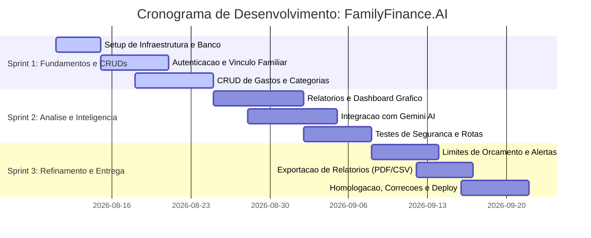

# Documento de Requisitos e Backlog do Produto: FamilyFinance.AI

Este documento descreve as especificações técnicas, regras de negócio, lista de requisitos e o backlog inicial do sistema **FamilyFinance.AI**, uma plataforma web responsiva para planejamento e gerenciamento de finanças pessoais e familiares com auxílio de Inteligência Artificial.

---

## 🎯 1. Visão Geral do Sistema
O **FamilyFinance.AI** é uma aplicação web focada em ajudar usuários individuais e núcleos familiares a registrarem seus gastos cotidianos, classificarem suas despesas por categorias, visualizarem relatórios mensais analíticos e utilizarem Inteligência Artificial para gerar um planejamento orçamentário otimizado para o mês subsequente. O sistema adota a arquitetura de múltiplos inquilinos por família (*multi-tenant*), onde os dados são isolados por grupo familiar, mas cada usuário mantém sua própria conta individual de acesso.

---

## 📋 2. Requisitos do Sistema

### Requisitos Funcionais (RF)
*   **RF01 - Autenticação e Gestão de Contas:** O sistema deve permitir que o usuário se cadastre, faça login, faça logout e recupere a sua senha de forma segura.
*   **RF02 - Vínculo de Grupo Familiar:** O usuário criador do grupo (Administrador do Grupo) deve poder convidar membros da família por e-mail para compartilhar o mesmo ambiente financeiro.
*   **RF03 - Cadastro de Gastos Diários:** O usuário deve poder registrar gastos contendo: valor (positivo/negativo), data da transação, descrição, categoria (tipo de gasto) e forma de pagamento.
*   **RF04 - Gestão de Categorias:** O sistema deve permitir que os usuários criem, editem e excluam categorias personalizadas de gastos (ex: alimentação, transporte, educação, lazer), além de disponibilizar categorias padrão.
*   **RF05 - Painel de Controle (Dashboard) e Relatórios:** O sistema deve gerar relatórios mensais e gráficos interativos que dividam as despesas por categorias, mostrando totais acumulados e comparação com meses anteriores.
*   **RF06 - Planejamento Assistido por IA:** O sistema deve enviar os dados consolidados do histórico de gastos do mês anterior (anonimizados por ID) para uma IA (Google Gemini) e exibir sugestões personalizadas de orçamento, limites de despesas por categoria e dicas de economia para o próximo mês.

### Requisitos Não-Funcionais (RNF)
*   **RNF01 - Tecnologia Web:** O sistema deve ser desenvolvido utilizando o framework Next.js 16 (React 19, App Router, TypeScript) para garantir renderização veloz, SEO inicial e suporte a Server Actions.
*   **RNF02 - Design Responsivo e Acessibilidade:** A interface do sistema deve ser otimizada para dispositivos móveis (Mobile-First) e desktop, utilizando Tailwind CSS e componentes acessíveis baseados em Shadcn UI.
*   **RNF03 - Persistência e Isolamento de Dados:** Os dados de transações e finanças de um grupo familiar devem ser rigidamente isolados em nível de banco de dados (multi-tenant por `familyId`), usando PostgreSQL com ORM Prisma.
*   **RNF04 - Desempenho e Tempo de Resposta da IA:** As chamadas à API do Gemini para processamento de IA devem ser processadas de forma assíncrona com exibição de esqueleto de carregamento (*skeleton screen*), não bloqueando a interface por mais de 5 segundos.

### Regras de Negócio (RN)
*   **RN01 - Limitação de Vínculo Familiar:** Um usuário pode pertencer a apenas um grupo familiar por vez.
*   **RN02 - Permissões do Grupo:** Apenas o criador do grupo familiar (Administrador) tem permissão para convidar ou remover membros da conta de família. Membros convidados podem registrar transações e ler relatórios, mas não gerenciam membros da equipe.
*   **RN03 - Consistência de Datas:** Não é permitido registrar transações com data futura no painel de gastos diários (apenas a data corrente ou retroativas).
*   **RN04 - Exclusão de Categorias:** Caso uma categoria com transações associadas seja excluída, as transações correspondentes devem ser automaticamente reatribuídas a uma categoria padrão chamada "Outros".

---

## 🗂️ 3. Product Backlog e Estimativa de Esforço
O esforço das histórias de usuário foi estimado pela equipe de 5 alunos na reunião de planejamento utilizando a sequência de Fibonacci ($1, 2, 3, 5, 8, 13$), onde cada ponto representa um esforço relativo de complexidade e incerteza técnica.

| ID | História de Usuário | Critérios de Aceitação | Esforço (SP) |
| :--- | :--- | :--- | :---: |
| **US01** | Como usuário, quero me cadastrar e logar na aplicação para que minhas informações financeiras fiquem seguras. | - Login com e-mail e senha. - Validação de campos obrigatórios. - Senhas criptografadas no banco. | **3 SP** |
| **US02** | Como usuário, quero convidar membros da minha família para que possamos gerenciar as finanças juntos. | - Envio de convite via e-mail. - Aceitação do convite vincula o usuário ao `familyId`. | **5 SP** |
| **US03** | Como usuário, quero registrar meus gastos diários para que eu possa acompanhar minhas saídas financeiras. | - Formulário intuitivo (valor, data, categoria, descrição). - Listagem em ordem cronológica reversa. | **3 SP** |
| **US04** | Como usuário, quero criar e gerenciar categorias de gastos para organizar minhas despesas da melhor forma. | - CRUD de categorias customizadas. - Associação padrão ao deletar categorias. | **2 SP** |
| **US05** | Como família, queremos ver relatórios mensais e gráficos de gastos para sabermos onde estamos gastando mais. | - Dashboard com gráficos de pizza/barras. - Filtro por mês/ano e categoria. - Visualização do total gasto vs receita. | **5 SP** |
| **US06** | Como usuário, quero receber sugestões de planejamento financeiro geradas por uma IA para economizar dinheiro. | - Integração com a API do Gemini. - Leitura automatizada das despesas do mês anterior. - Geração de orçamento sugerido em formato Markdown na tela. | **8 SP** |
| **US07** | Como desenvolvedor, preciso configurar a infraestrutura inicial do projeto Next.js 16 e Banco de Dados. | - Configuração do Next.js 16 com Tailwind. - Docker Compose para banco de dados PostgreSQL. - Configuração do Prisma ORM e migrações iniciais. | **3 SP** |
| **US08** | Como desenvolvedor, preciso implantar testes automatizados para as rotas e funções críticas de negócio. | - Configuração do Vitest para testes de integração. - Cobertura mínima de 80% nas funções de cálculo financeiro e rotas de IA. | **5 SP** |
| **US09** | Como usuário, quero exportar meus relatórios de gastos em PDF ou planilha para arquivamento pessoal. | - Botão de exportação em PDF e CSV no painel de relatórios. - Layout do PDF formatado de forma limpa. | **3 SP** |
| **US10** | Como usuário, quero definir limites de orçamento por categoria para receber alertas visuais quando estiver perto do limite. | - Definição de metas de gastos em $ por categoria. - Mudança de cor da categoria (verde para vermelho) no dashboard quando ultrapassado. | **5 SP** |
| **Total**| **Esforço Total do Backlog do Produto (MVP)** | | **42 SP** |

---

## 📅 4. Calendário de Desenvolvimento do Sistema (Cronograma Macro)
O projeto está planejado para ser executado em **3 Sprints** de 2 semanas cada (total de 6 semanas de desenvolvimento).

### Detalhamento dos Marcos (Milestones)
1.  **Marco 1 - Fim da Sprint 1 (24/08/2026):** Aplicação rodando localmente com autenticação funcional, suporte a múltiplos usuários vinculados na mesma família e inserção/listagem de gastos diários.
2.  **Marco 2 - Fim da Sprint 2 (07/09/2026):** Painel gráfico interativo ativo e a Inteligência Artificial lendo os dados reais da família para emitir previsões e sugestões automáticas.
3.  **Marco 3 - Fim da Sprint 3 (22/09/2026):** Produto final refinado com controle de metas financeiras, exportação de arquivos, testes integrados de segurança validados e aplicação pronta para deploy em ambiente de produção (Vercel).
