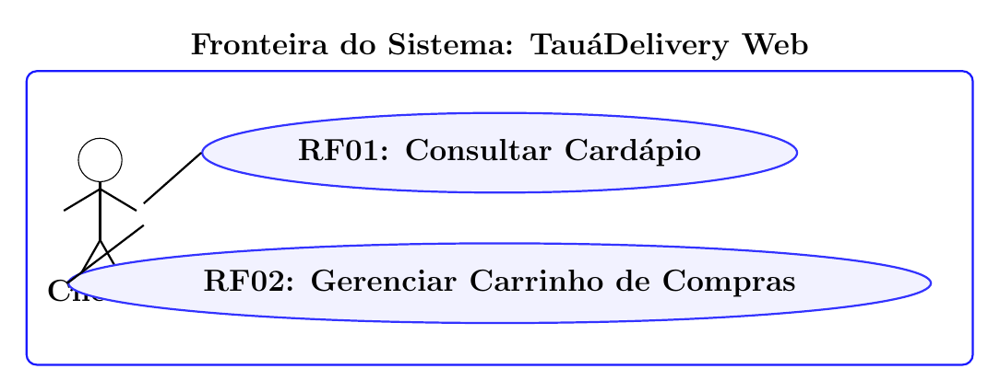
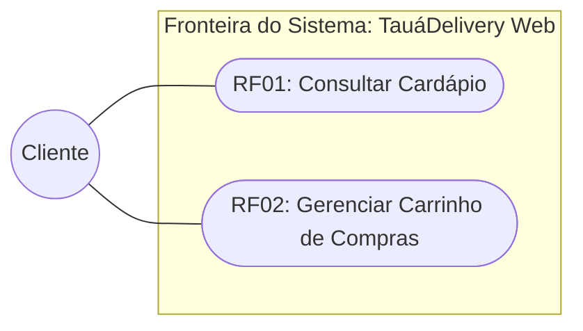

# Atividade Prática: Modelagem e Especificação de Casos de Uso

*   **Disciplina:** Engenharia de Software (Código: TSII.210 / 17.202.9 | Carga Horária: 80h)
*   **Curso:** Técnico em Informática para Internet
*   **Instituição:** Instituto Federal do Ceará (IFCE) - Campus Tauá
*   **Professor:** Reginaldo Pereira Fernandes
*   **Aula 20:** Introdução à UML, Revisão de OO e Diagrama de Casos de Uso
*   **Referência Básica:** Capítulos 1, 2 e 3 do livro *UML 2 – Uma abordagem prática* (Gilleanes T. A. Guedes).

---

## 🎯 1. Objetivos

1.  Diferenciar requisitos funcionais e mapeá-los para Casos de Uso segundo as diretrizes da UML 2.
2.  Identificar e posicionar atores (humanos e sistemas externos) e estruturar a Fronteira do Sistema (*System Boundary*).
3.  Aplicar os relacionamentos de associação, generalização/especialização, inclusão (`<<include>>`) e extensão (`<<extend>>`).
4.  Elaborar especificações textuais formais completas (pré-condições, pós-condições, fluxo principal, alternativos e de exceção).

---

## 📋 2. Requisitos do Sistema: *TauáDelivery Web*

A startup *TauáDelivery* está construindo uma aplicação web de comércio eletrônico para entrega de refeições na região dos Inhamuns. A seguir são descritos os requisitos funcionais levantados:

*   **RF01 - Consultar Cardápio:** O Cliente deve poder pesquisar restaurantes parceiros e visualizar os pratos e produtos disponíveis, organizados por categorias e preços.
*   **RF02 - Gerenciar Carrinho de Compras:** O Cliente deve poder adicionar produtos, alterar quantidades e remover itens do carrinho de compras antes da conclusão.
*   **RF03 - Finalizar Pedido:** O Cliente seleciona a opção de fechar a compra, confirma o endereço de entrega e escolhe a forma de pagamento para efetivação do pedido.
*   **RF04 - Autenticar Usuário:** O sistema valida o e-mail e a senha do usuário cadastrado. Este processo deve ser obrigatoriamente executado durante a finalização do pedido caso o usuário não esteja previamente autenticado na sessão.
*   **RF05 - Processar Pagamento:** O sistema transmite o valor da transação e os dados de cobrança ao Gateway de Pagamento bancário para validação e liquidação financeira. A aprovação é obrigatória para a conclusão do pedido.
*   **RF06 - Aplicar Cupom de Desconto:** O Cliente pode, opcionalmente, informar um cupom promocional durante a finalização do pedido para obter abatimento sobre o valor total da compra.
*   **RF07 - Solicitar Talheres Descartáveis:** O Cliente pode, opcionalmente, marcar a inclusão de talheres e guardanapos descartáveis antes de enviar o pedido.
*   **RF08 - Cancelar Pedido:** O Cliente pode solicitar o cancelamento do pedido caso o estabelecimento ainda não tenha iniciado o preparo dos alimentos.
*   **RF09 - Atualizar Status do Pedido:** O Restaurante Parceiro deve poder alterar o estado operacional do pedido (`Aguardando Confirmação`, `Em Preparo`, `Pronto para Coleta`).
*   **RF10 - Aceitar Corrida de Entrega:** O Entregador visualiza os pedidos prontos para coleta na sua região e assume o transporte até o endereço de destino.
*   **RF11 - Confirmar Entrega ao Destinatário:** O Entregador registra a entrega do pedido ao cliente no sistema mediante código de validação.
*   **RF12 - Avaliar Atendimento:** O Cliente pode, opcionalmente, atribuir nota de 1 a 5 e registrar comentários sobre o restaurante e sobre o serviço do entregador após a entrega concluída.
*   **RF13 - Gerenciar Perfil de Usuário:** Qualquer Usuário Cadastrado (tanto o Cliente quanto o Entregador) pode atualizar seus dados cadastrais e redefinir sua senha de acesso.

---

## 💡 3. Exemplo Resolvido de Apoio: Modelagem dos Requisitos RF01 e RF02

Para orientar a resolução dos desafios, apresentamos a modelagem completa dos dois primeiros requisitos funcionais do sistema:

### 3.1 Diagrama de Casos de Uso (RF01 e RF02)

O diagrama a seguir demonstra o posicionamento do Ator `Cliente`, a Fronteira do Sistema delimitando o escopo da aplicação web, e as elipses correspondentes aos casos de uso **RF01** e **RF02**:

### 3.2 Especificação Textual Formal de Referência

Abaixo é apresentada a ficha técnica padrão dos casos de uso modelados:

#### Ficha do Caso de Uso UC01 (RF01): Consultar Cardápio
*   **Identificador:** `UC01`
*   **Nome:** Consultar Cardápio
*   **Ator Principal:** Cliente
*   **Resumo:** Permite ao cliente navegar pela lista de restaurantes disponíveis em Tauá, visualizar os pratos por categoria (lanches, bebidas, refeições) e conferir preços e descrições dos itens.
*   **Pré-condições:** O sistema deve estar online e com restaurantes previamente cadastrados na base de dados.
*   **Pós-condições:** O cardápio do restaurante selecionado é exibido com fotos, valores e opções de personalização.
*   **Fluxo Principal:**
    1. O Cliente acessa a página inicial do *TauáDelivery Web*.
    2. O Sistema exibe a listagem de restaurantes parceiros abertos.
    3. O Cliente seleciona um restaurante específico.
    4. O Sistema carrega e exibe o cardápio organizado em categorias.
    5. O Cliente clica sobre um item para visualizar a descrição e os ingredientes.
*   **Fluxo Alternativo (FA01 - Busca por Termo ou Categoria):**
    *   No passo 2, o Cliente digita o nome de um prato ou categoria no campo de busca (ex.: "pizza").
    *   O Sistema filtra e exibe os restaurantes e itens que atendem ao critério de busca.
*   **Fluxo de Exceção (FE01 - Restaurante Fechado no Horário):**
    *   No passo 3, caso o estabelecimento tenha encerrado o expediente, o Sistema exibe aviso informando o horário de reabertura e desabilita a adição de itens.

#### Ficha do Caso de Uso UC02 (RF02): Gerenciar Carrinho de Compras
*   **Identificador:** `UC02`
*   **Nome:** Gerenciar Carrinho de Compras
*   **Ator Principal:** Cliente
*   **Resumo:** Permite ao cliente adicionar itens do cardápio ao carrinho, ajustar quantidades, inserir observações de preparo e remover itens antes do fechamento do pedido.
*   **Pré-condições:** O cliente deve estar visualizando o cardápio de um restaurante (UC01 concluído).
*   **Pós-condições:** Os itens selecionados e os valores parciais e totais são calculados e mantidos na sessão do usuário.
*   **Fluxo Principal:**
    1. O Cliente clica no botão "Adicionar ao Carrinho" no item visualizado.
    2. O Sistema valida a disponibilidade do item e adiciona o produto ao carrinho.
    3. O Sistema atualiza o subtotal e o contador de itens no cabeçalho da página.
    4. O Cliente abre o carrinho para conferência.
    5. O Sistema exibe a lista dos itens, quantidades, valores unitários e o total acumulado.
*   **Fluxo Alternativo (FA01 - Alteração de Quantidade ou Remoção):**
    *   No passo 4, o Cliente incrementa a quantidade ou clica no ícone de exclusão de um produto.
    *   O Sistema recalcula instantaneamente os valores e atualiza o resumo do pedido.
*   **Fluxo de Exceção (FE01 - Adição de Restaurantes Distintos):**
    *   No passo 1, se o carrinho já contiver itens de outro estabelecimento, o Sistema alerta que o carrinho atual será esvaziado caso confirme a troca e solicita a confirmação do Cliente.

---

## 📝 4. Desafios Propostos para os Alunos

### PARTE 1: Análise Conceitual e Fixação (3,0 Pontos)

#### Questão 1.1: Identificação e Papel dos Atores
1. A partir dos requisitos do sistema, liste todos os atores e classifique-os em **Atores Humanos** ou **Sistemas Externos**.
2. Por que o Gateway de Pagamento deve ser modelado como um Ator externo e não como uma rotina interna do software?

#### Questão 1.2: Relacionamentos entre Casos de Uso
1. Analise a relação entre **RF03 (Finalizar Pedido)** e **RF05 (Processar Pagamento)**: classifique o relacionamento em `<<include>>` ou `<<extend>>`, justifique a resposta e informe a direção da seta.
2. Analise a relação entre **RF03 (Finalizar Pedido)** e **RF06 (Aplicar Cupom de Desconto)**: classifique o relacionamento em `<<include>>` ou `<<extend>>`, justifique a resposta e informe a direção da seta.

#### Questão 1.3: Fronteira do Sistema
1. Qual é o papel da Fronteira do Sistema (*System Boundary*) na UML?
2. Em qual posição da fronteira devem figurar os Atores e os Casos de Uso?

---

### PARTE 2: Construção do Diagrama de Casos de Uso (4,0 Pontos)

Utilizando como base o modelo resolvido de **RF01 e RF02** apresentado na Seção 3, construa o **Diagrama de Casos de Uso completo** contemplando os requisitos **RF01 a RF13**:

1.  **Fronteira:** Delimite o retângulo nomeado "*TauáDelivery Web*".
2.  **Atores:** Represente `Cliente`, `Entregador`, `Restaurante Parceiro`, `Gateway de Pagamento` e a generalização `Usuário Cadastrado`.
3.  **Casos de Uso:** Insira os casos de uso para todos os requisitos listados, garantindo nomes iniciados por verbos no infinitivo.
4.  **Relacionamentos:**
    *   Mapeie as associações dos atores com seus respectivos casos de uso;
    *   Aplique herança de atores (`Cliente` e `Entregador` herdando de `Usuário Cadastrado`);
    *   Aplique os estereótipos `<<include>>` (de *Finalizar Pedido* para *Autenticar Usuário* e *Processar Pagamento*);
    *   Aplique os estereótipos `<<extend>>` (de *Aplicar Cupom* e *Solicitar Talheres* para *Finalizar Pedido*);
    *   Conecte o ator externo `Gateway de Pagamento` ao caso de uso *Processar Pagamento*.

---

### PARTE 3: Especificação Textual do Caso de Uso (3,0 Pontos)

Seguindo o padrão das fichas de **UC01 e UC02** fornecidas no exemplo resolvido, redija a especificação técnica formal do caso de uso **RF03 - Finalizar Pedido**:

*   **Identificador:** `UC03`
*   **Nome do Caso de Uso:** Finalizar Pedido
*   **Ator Principal:** Cliente
*   **Atores Secundários / Apoio:** Gateway de Pagamento
*   **Resumo:** Descrição sucinta da finalidade.
*   **Pré-condições:** Condições exigidas para inicialização.
*   **Pós-condições:** Garantias do sistema após a conclusão.
*   **Fluxo Principal:** Sequência numerada de passos alternando as ações do Cliente e as respostas do Sistema (mínimo de 6 passos).
*   **Fluxo Alternativo (FA01 - Cupom de Desconto):** Passos de inserção e aplicação do abatimento.
*   **Fluxo de Exceção (FE01 - Recusa Financeira):** Tratamento em caso de transação negada pelo Gateway.

---

## 📊 5. Rubrica de Avaliação

| Critério | Peso | Atendimento Pleno (100%) | Atendimento Parcial (60%) | Não Atendido (0-30%) |
| :--- | :---: | :--- | :--- | :--- |
| **Domínio Conceitual (Parte 1)** | 30% | Responde com clareza conceitual a classificação de atores, fronteira e semântica de include/extend. | Pequenas imprecisões conceituais ou inversão de seta. | Confusão sobre atores, fronteira ou significado dos estereótipos. |
| **Diagrama de Casos de Uso (Parte 2)** | 40% | Notação visual precisa: fronteira, elipses, herança e setas de include e extend com direções corretas. | Diagrama funcional com omissões pontuais de fronteira ou associações. | Diagrama incompleto, sem atores ou com fluxo procedural. |
| **Especificação Textual (Parte 3)** | 30% | Ficha técnica completa nos moldes do exemplo fornecido, com passos claros e fluxos de exceção bem definidos. | Ficha preenchida com passos vagos ou sem tratamento de exceção. | Descrição superficial sem etapas ordenadas. |

---

## 🔑 6. Gabarito Comentado

### Respostas da Parte 1:
*   **1.1.1:**
    *   *Atores Humanos:* `Cliente`, `Entregador`, `Restaurante Parceiro`, `Usuário Cadastrado`.
    *   *Sistemas Externos:* `Gateway de Pagamento`.
*   **1.1.2:** O Gateway de Pagamento é uma entidade computacional independente externa à aplicação desenvolvida, interagindo com o sistema pela troca de requisições e respostas financeiras.
*   **1.2.1:** Relacionamento de **Inclusão (`<<include>>`)**, pois a transação de pagamento é obrigatória para que o pedido seja concluído. A seta aponta do caso base para o incluído: `Finalizar Pedido ----<<include>>---> Processar Pagamento`.
*   **1.2.2:** Relacionamento de **Extensão (`<<extend>>`)**, pois a inserção de cupom é uma funcionalidade opcional e condicional à vontade do cliente. A seta aponta do caso extensor para o caso base: `Aplicar Cupom de Desconto ----<<extend>>---> Finalizar Pedido`.
*   **1.3.1:** A Fronteira do Sistema delimita o que faz parte do software a ser construído e o que é ambiente externo.
*   **1.3.2:** Os Casos de Uso situam-se **dentro** da fronteira; os Atores situam-se **fora** da fronteira.

### Especificação Esperada da Parte 3 (UC03):
*   **Identificador:** `UC03`
*   **Nome:** Finalizar Pedido
*   **Atores:** Cliente (Principal), Gateway de Pagamento (Secundário)
*   **Pré-condições:** O cliente deve possuir pelo menos um item ativo no carrinho de compras.
*   **Pós-condições:** O pedido é gravado no banco de dados com status `Aguardando Confirmação` e o restaurante é notificado.
*   **Fluxo Principal:**
    1. O Cliente clica em "Finalizar Pedido" a partir do carrinho de compras.
    2. O Sistema executa o caso de uso `Autenticar Usuário` (caso não esteja logado).
    3. O Sistema apresenta o endereço padrão de entrega e as formas de pagamento disponíveis.
    4. O Cliente confirma o endereço e escolhe a forma de pagamento.
    5. O Sistema executa o caso de uso `Processar Pagamento`, enviando os dados ao Gateway de Pagamento.
    6. O Gateway valida os dados e confirma a aprovação da cobrança.
    7. O Sistema gera o identificador do pedido, atualiza o status para `Aguardando Confirmação`, exibe a tela de confirmação ao Cliente e envia notificação ao Restaurante Parceiro.
*   **Fluxo Alternativo (FA01 - Cupom de Desconto):**
    *   No passo 3, o Cliente digita o código no campo de cupom e clica em "Aplicar" (caso de uso estendido `Aplicar Cupom de Desconto`).
    *   O Sistema valida as regras do cupom, deduz o percentual e recalcula o total a pagar, retornando ao passo 4 do fluxo principal.
*   **Fluxo de Exceção (FE01 - Recusa de Pagamento):**
    *   No passo 6, o Gateway rejeita a transação financeira (saldo insuficiente ou cartão inválido).
    *   O Sistema exibe o motivo da recusa e orienta o Cliente a escolher outra opção de pagamento, retornando ao passo 4.
